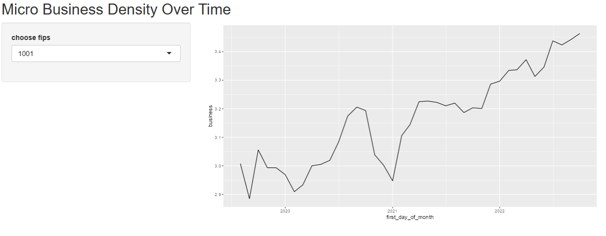

Interactive_linegraph
================
Lindsey Dorson

``` r
library(shiny)
library(readr)
library(dplyr)
library(magrittr)
library(ggplot2)
```

``` r
######### shiny linegragh with sidebar
theme_set(theme_grey())
train <- read_csv("data/train.csv")
census <-read_csv("data/census_starter.csv")
merg <- merge(train,census,by = c("cfips"))

server <- function(input, output, session) {
  
   merg<-merg
    
    
    data <- reactive({
      req(input$fips)
      df <- merg %>% filter(cfips %in% input$fips) %>%
      group_by(first_day_of_month) %>% summarise(business = sum(microbusiness_density))
    })
    
    output$plot <-renderPlot({
      g<-ggplot(data(),aes(y = business, x = first_day_of_month))
      g + geom_line()
    }) 
    
}

ui <- fluidPage(
  
  titlePanel("Micro Business Density Over Time"),
  
  sidebarLayout(
  
      sidebarPanel( 
        selectInput(inputId = "fips",
                    label = "choose fips",
                    choices = sort(unique(merg$cfips)))),
  mainPanel(
    plotOutput("plot")
  )
 )
)
```

    ## Warning: The select input "fips" contains a large number of options; consider
    ## using server-side selectize for massively improved performance. See the Details
    ## section of the ?selectizeInput help topic.

``` r
shinyApp(ui, server)
```

<div style="width: 100% ; height: 400px ; text-align: center; box-sizing: border-box; -moz-box-sizing: border-box; -webkit-box-sizing: border-box;" class="muted well">Shiny applications not supported in static R Markdown documents</div>


